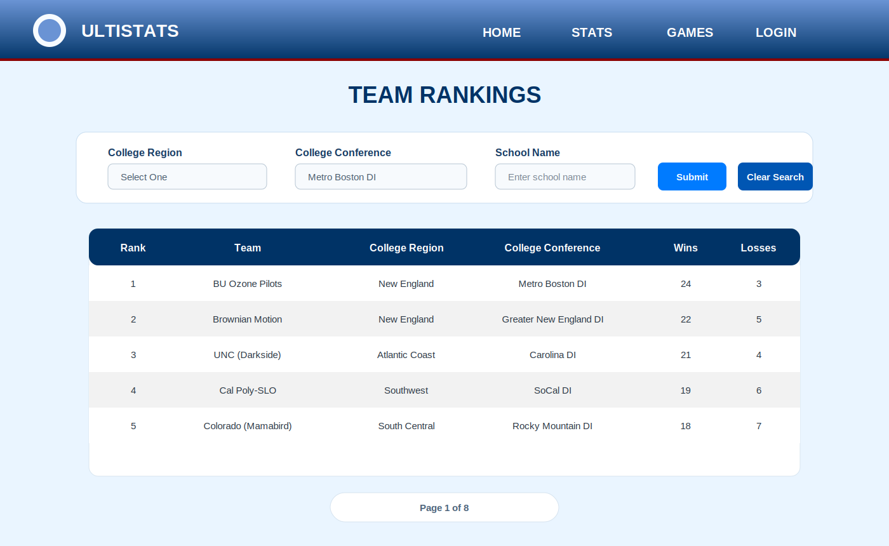

# UltiStats

UltiStats is a Django web app for tracking and exploring college ultimate frisbee data. It lets users browse team rankings, search players, review team and game statistics, compare teams head to head, and export stats as CSV files. The app also pulls in recent USA Ultimate college news to keep the homepage current.

Live site:
https://scientist-quotes-0e629fe0ba9a.herokuapp.com/ultistats/

## What The Project Does

- Displays Division I team rankings with filters for region, conference, and school name.
- Provides player search with individual player detail pages and aggregated stats.
- Shows team detail pages with rosters, season stats, win percentage, and head-to-head comparisons.
- Organizes games by tournament and supports per-game stat entry and review.
- Exports player, team, and game data to CSV.
- Scrapes recent college ultimate headlines for the homepage.

## Tech Stack

- Python 3.12
- Django
- SQLite
- HTML templates with Django Template Language
- CSS
- Pillow for image handling
- Plotly
- Requests
- Beautiful Soup
- `usau_scraper`
- Gunicorn for deployment
- Heroku for hosting

## Screenshot

The UI below shows the team rankings filters and stats table that power the team discovery workflow:



## ML Prediction Model Note

This repository does not currently include the training or inference code for a machine learning prediction model. If you are pairing this app with an ML component, the intended fit is as a presentation layer for future matchup or outcome predictions alongside the existing stats pages. Until that model is added here, the app should be treated as a stats, rankings, and data-management platform rather than a production prediction system.

## Local Development

```bash
cd /c/Users/Victor/django/django-projects
pipenv install
pipenv run python manage.py migrate
pipenv run python manage.py runserver
```

Local app URL:
http://127.0.0.1:8000/
